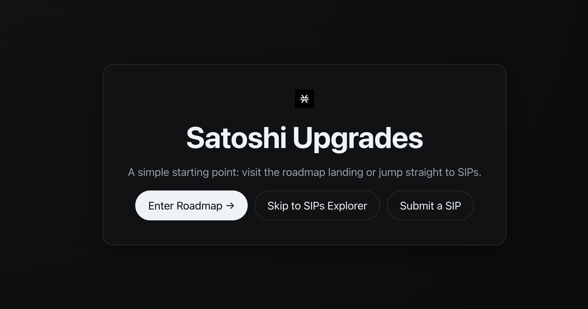

# Stacks SIPs Suite



A polished, minimal suite for exploring and composing Stacks Improvement Proposals (SIPs).

- Live demo: https://stacks-catalyst-rfc-sip-production.up.railway.app/
- Repo: this repository

## What’s Inside

- SIPs Explorer (index.html)
  - Filterable grid, dark mode, full markdown view per SIP
  - Data source: `sips.json` (generated from `sips-main/sips`)
- SIP Submit (submit-sip.html)
  - Guided form that generates a complete SIP in Markdown
  - Copy-to-clipboard, supports Markdown bullets and code blocks
- Pre-Landing (pre.html)
  - Simple entry with CTAs to Landing, Explorer, and Submit
- Landing (landing.html)
  - Focused overview with links to Explorer and Submit

## Quick Start (Local)

```bash
# 1) Generate sips.json from the official SIPs directory
python3 parse_sips.py --input sips-main/sips --output sips.json

# 2) Serve locally
python3 -m http.server 8000 &
open http://localhost:8000/pre.html
```

## Deploy (Railway)

This repo includes a minimal Nixpacks config and Python entrypoint.

- Start command: `python3 app.py`
- Root `/` serves `pre.html`

Steps:
1. Connect repo to Railway and deploy
2. Ensure Start Command is `python3 app.py`
3. Open assigned Railway URL

## JSON Generation

`parse_sips.py` supports two input modes:

- From a combined text: `--input stacksgov-sips-*.txt`
- From official directory: `--input sips-main/sips` (recommended)

It outputs an array of entries containing: `sip`, `title`, `type`, `license`, `authors[]`, `emails[]`, and `path` (markdown path).

## Viewer Notes

- `view.html` safely renders markdown and rewrites relative asset links
- Uses `marked` and `DOMPurify` via CDN

## Submit a SIP (Console Snippets)

- Dump/Copy:
```js
(() => {
  const md = window.buildMarkdown?.();
  console.log("\n--- SIP Markdown ---\n" + md);
  navigator.clipboard?.writeText(md).catch(()=>{});
})();
```

- Auto-fill demo with Clarity code in Reference Implementations:
```js
(() => {
  const set=(id,v)=>{const e=document.getElementById(id);if(e)e.value=v};
  set("title","Stacks Endowment Growth Round and Ecosystem Acceleration");
  set("consideration","Economics, Technical, Governance");
  set("type","Consensus (hard fork)");
  set("status","Draft");
  set("license","BSD 2-Clause");
  set("authors","- Jane Doe (jane@example.com)\n- John Smith (john@example.com)");
  set("abstract","High-level summary of the proposal.");
  set("specification","### Details\n- Part A\n- Part B");
  set("activation","Define voting thresholds and fork height.");
  set("refs","- Reference: https://github.com/example\n\n```clarity\n(define-public (demo (x uint)) (ok x))\n```\n");
  const md=window.buildMarkdown?.();
  console.log("\n--- SIP Markdown ---\n"+md);
})();
```

## Structure

```
pre.html           # Pre-landing
landing.html       # Landing overview
index.html         # SIPs Explorer
submit-sip.html    # SIP submission -> Markdown
view.html          # Markdown viewer
parse_sips.py      # Builds sips.json
sips-main/         # Official SIPs
sips.json          # Generated dataset
app.py             # Serves pre.html at '/'
```


