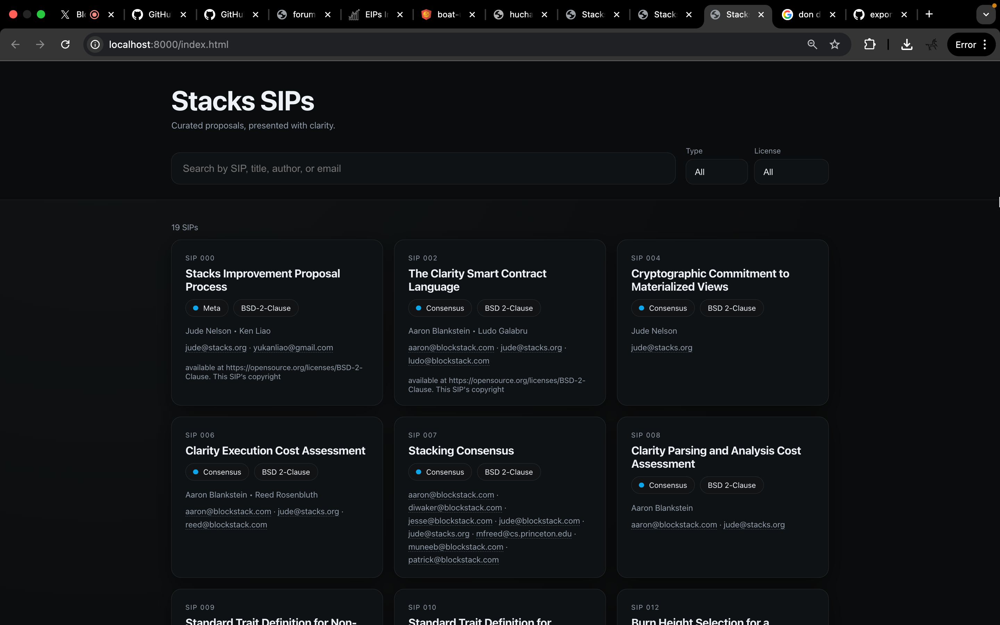

# 🥃 Stacks SIPs — Draper Edition




> "Make it simple, but significant." — Don Draper

Curated Stacks Improvement Proposals, presented with clarity, whitespace, and taste. Built for Kernels, with a nod to Mad Men minimalism.

## 🚀 Quick Launch

```bash
# 1) Generate structured data from the SIP source
python3 parse_sips.py \
  --input stacksgov-sips-8cc4733e8c7d2679.txt \
  --output sips.json

# 2) Run a local static server (avoids file:// CORS)
python3 -m http.server 8000 &

# 3) Open the experience
open http://localhost:8000/index.html
```

To stop the server:
```bash
killall -9 Python
```

## ✨ What You Get

- **Elegant cards**: SIP, Title, Type, License, Authors, Emails, Copyright
- **Search**: by SIP number, title, author, or email
- **Filters**: Type and License
- **Responsive**: mobile-first, desktop-perfect
- **Dark mode**: follows system preference

## 🧱 Structure

```
index.html      # Layout + controls
styles.css      # Typography, spacing, cards, dark mode
app.js          # Data loading, search, filters, rendering
parse_sips.py   # SIP text → JSON (authors, emails, SIP, title, type, license, copyright)
sips.json       # Generated dataset
stacksgov-*.txt # SIP source (input)
```

## 🛠 Configuration

- **Accent color**: edit `--accent` in `styles.css`
- **Spacing**: adjust `.container` padding and `.grid` gap
- **Data source**: regenerate `sips.json` via `parse_sips.py`

## 🧭 Design Notes (For Kernels)

- **Whitespace is a feature**: generous margins, breathable line height
- **Typographic hierarchy**: bold titles, quiet metadata
- **Soft motion**: subtle elevation and hover shifts
- **Restraint**: no unnecessary chrome; content leads

## 📦 One-Liner Setup

```bash
python3 parse_sips.py --input stacksgov-sips-8cc4733e8c7d2679.txt --output sips.json && \
python3 -m http.server 8000 & sleep 1 && \
open http://localhost:8000/index.html
```

## 🌐 Publish

- **GitHub Pages**: push these files to a public repo and enable Pages (root)
- **Static hosts**: any CDN/static host will work as-is
- **Railway**: deploy with Nixpacks. This repo includes `nixpacks.toml` to serve via Python's http.server.
  1) Create new project → Deploy from GitHub
  2) Set service root to repo root
  3) Confirm detected Start Command: `python3 -m http.server $PORT --bind 0.0.0.0`
  4) Deploy; open the assigned URL

## 🧪 Troubleshooting

- If the page is blank from file://, serve over http with `python3 -m http.server`
- Hard refresh if data changes: `Cmd+Shift+R`

---

Made with taste, whitespace, and a splash of 1960s confidence. 🥂


